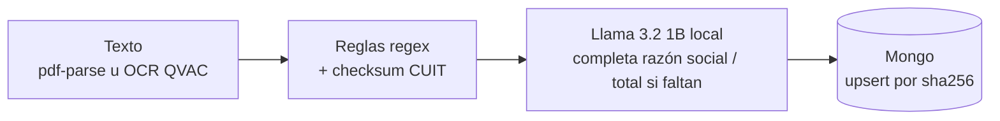

# FactuPipe

Extractor local de facturas argentinas: PDF o foto → JSON (CUIT, razón social, número, fecha, neto, IVA, total, moneda, CAE) en Mongo. Sin API paga ni internet.

**Problema:** los comprobantes llegan como PDF, escaneo o foto, y el OCR se come dígitos (`30-00000000-7` → `300o0c0o007`). Mejor un campo vacío y marcado que un dato inventado.



## Decisiones

**Reglas primero.** `normalize.ts` extrae con regex, determinista y testeable sin GPU. El 1B completa solo lo que falta (`total: rules.total ?? llmTotal`), así que nunca pisa un total que las reglas ya encontraron. Hoy el 1B se llama siempre que hay texto, aunque las reglas ya hayan encontrado todo. Pendiente: no llamarlo cuando la factura ya es `complete`.

**CUIT.** Si trae una letra donde va un dígito o no cierra el módulo 11, queda `cuit: null` con `warnings: ["cuit_checksum"]`. Las letras no se convierten en cero, y un resultado 10 se trata como inválido. Solo se toma el CUIT etiquetado como tal; aun así, un OCR que cambia dígitos puede dar por casualidad un CUIT válido.

**1B local, no nube.** Sin costo variable y los datos no salen de la máquina. Debilidad real: un 1B no devuelve JSON estable. Se le piden solo dos claves (`merchantName`, `totalAmount`), el JSON se repara con tolerancia y, si falla, quedan las reglas.

**Mongo.** Documento variable (`rawText`, campos opcionales, `warnings`), sin joins. Postgres con JSONB también serviría.

**Idempotencia.** Clave: sha256 del archivo, índice único. Una factura `complete` no se pisa: el job queda `done` con `skipped: true` y sube `ingestCount`. Un reintento peor (menos campos clave, u OCR vacío) solo llena huecos; uno igual o mejor actualiza.

**Jobs.** Cada ingesta es un job `queued → running → done | failed` (`GET /jobs/:id`), procesado por un único worker, de a una factura.
- **Timeout** (`JOB_TIMEOUT_MS`, 120 s por defecto): el job queda `failed` con `errorCode: "timeout"`. La operación no se cancela, pero un resultado tardío no se escribe.
- **Reinicio:** un job `running` queda `failed` con `errorCode: "process_restarted"` (a propósito, no se sabe hasta dónde llegó). Los `queued` se retoman en orden.
- **OCR colgado:** los jobs siguientes con OCR vencen hasta reiniciar el proceso. No hay estado "qvac stuck".

## Observabilidad

Una línea JSON por factura en stdout, incluidas `skipped`, `failed` y `timeout` (no la de un job cortado por reinicio):
- identificación: `ts`, `jobId`, `contentHash`;
- resultado: `outcome`, `errorCode`, `skipped`, `status`, `extraction`, `extractSource`;
- tiempos: `ocrMs`, `llmCalled`, `llmMs`, `totalMs`;
- calidad: `fieldsHit` (de 5 campos clave) y `fieldsPct`;
- latencia: `p95Ms` y `n`.

`totalMs` es el tiempo en el worker, sin cola. `p95Ms` cubre las últimas 200 facturas en memoria del proceso: se reinicia con él y no sale de Mongo. No se loguean `rawText` ni CUIT.

## Qué no hace

- No consulta AFIP/ARCA en vivo ni valida el CAE: el CAE solo se extrae del texto.
- No es multi-tenant ni tiene autenticación.
- No usa Redis ni una cola aparte del worker del proceso.
- No tiene fine-tune.

## Límites (B8 pendiente)

- **Factura C:** IVA 0 y neto = total. Ningún test exige `iva: 0`.
- **USD:** se guarda el total en USD, con `moneda: "USD"` (el golden lo testea). `totalArs` es derivado, pero `tipoCambio` hoy solo se detecta cuando vale 65.
- **EUR:** un `€` pegado al número no se detecta y la factura sale como ARS.

## Golden set

4 casos en `golden/*.json`, con el `rawText` real de QVAC y el `expected` del papel.
- La precisión no está publicada: todavía no hay un script que compare campo por campo, y dos de cuatro son plantilla.
- `npm test` compara contra `expectedFromRawText` (CUIT, warnings, moneda, total), no contra `expected`.
- arca-c y bit-excel: el CUIT impreso (`20-12345678-3` y `20-39380259-3`) no cierra módulo 11. El `expected` es `null`. El impreso queda en `cuitImpreso`, no se cuenta.

## Cómo correrlo

```bash
npm ci && cp .env.example .env   # Node >= 22.21, MONGODB_URI obligatoria
npm test && npx tsc --noEmit     # sin GPU ni Mongo; lo mismo corre en CI
npm run dev                      # http://localhost:3000, POST /api/upload (campo "factura")
```

QVAC con GPU es necesario para OCR y para el 1B; con `QVAC_ENABLED=0`, los PDF con texto se procesan solo con reglas.
